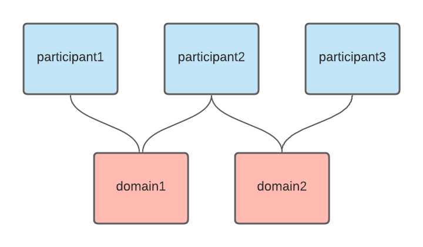

# Canton Multinode Example

This demonstrates using [canton](https://canton.io) in a configuration where all participant and domain  nodes are running as separate docker containers. This would be overkill for local development where [all nodes could be run in a single process](https://www.canton.io/docs/stable/user-manual/tutorials/getting_started.html#the-example-topology), however should serve as a useful example for understanding how a distributed multinode deployment could look.



In this example we setup 3 participant nodes and 2 domains. participant1 is connected to domain1, participant2 is connected to domain1 and domain2, participant3 is connected to domain3.

## Static Configuration

Each node has its own configuration defining the minimal set of options:
 * storage: each node requires its own database. In this example we host all databases on a single postgres server.
 * admin-api: used to remotely administer runtime configuration (parties, domains, DARs/applications). Typically access to this server should be restricted to only node administrators.
 * public/ledger-api: domains expose a public-api to allow remote participants to connect to them. Participants expose a ledger-api allowing DAML applications to connect. Typically access to this server should be available to remote participants and remote DAML applications.

The node configuration format is [hocon](https://github.com/lightbend/config/blob/master/HOCON.md) and further documentation on the available [static configuration options is in the canton user manual](https://www.canton.io/docs/stable/user-manual/usermanual/static_conf.html#). The examples here demonstrate using environment variable substitution within the config for the port definition.

## Running

```sh
docker-compose up
```

The docker compose file defines the containers for the database and all canton nodes.
You'll note in the static configuration that we bind all apis to the `0.0.0.0` address so they are
exposed on the public adapter of the container.
The port configuration within the docker-compose file then exposes these ports to your host.

On first run the databases will be created on startup.
Postgres will persist its data in a local  `db-data` directory on the host and this will be used if the containers are restarted.

To start with a fresh state remove the `db-data` directory when the nodes are stopped.

## Bootstrap Scripts

When starting a canton node you can specify a bootstrap script that allows you to execute admin commands to make changes to the nodes dynamic configuration every time the node is started. 

We use this here to connect the participants to domains (e.g. [`bootstrap.canton`](./participant1/bootstrap.canton)).

## Remote Administration

Canton allows you to connect domains, add parties, and add new DAML application DARs at runtime.
The nodes expose an admin-api and canton itself can be used as a client to perform these actions remotely.

[`remote.conf`](./remote.conf) contains configuration to point a local client at these remote nodes. We can launch a canton container with this config to start an interactive console using:

```sh
docker run --network host -it --rm -v "$PWD/remote.conf:/canton/remote.conf" digitalasset/canton-community:0.22.0 --config /canton/remote.conf
```

The commands that can be run within the console documented in the [Canton Console section of the canton user manual](https://www.canton.io/docs/stable/user-manual/usermanual/console.html). Here we demonstrate adding a new party to participant1:

```
   _____            _
  / ____|          | |
 | |     __ _ _ __ | |_ ___  _ __
 | |    / _` | '_ \| __/ _ \| '_ \
 | |___| (_| | | | | || (_) | | | |
  \_____\__,_|_| |_|\__\___/|_| |_|

  Welcome to Canton!
  Type `help` to get started. `exit` to leave.


@ participant1.parties.enable("alice")
res0: PartyId = alice::1220045b...

@ participant1.health.ping(participant2)
res2: concurrent.duration.Duration = 478 milliseconds
```